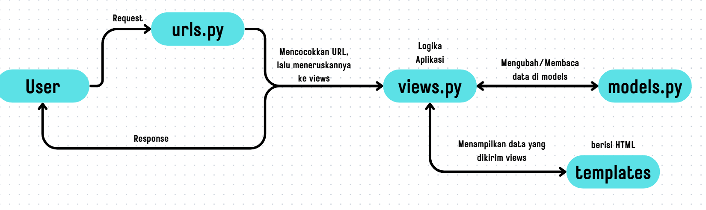

# Ball-Ballan

Proyek Django sederhana yang dikembangkan oleh Rexy Adrian Fernando 2406495666 sebagai pemenuhan tugas mata kuliah Pemrograman Berbasis Platform (PBP).

## Tugas 2

### Proses Pembuatan Proyek Django

#### Membuat Direktori dan Mengaktifkan Virtual Environment

1. Membuat folder direktori utama proyek bernama ```ball-ballan```.
2. Memindahkan direktori pada terminal ke direktori utama proyek.
3. Membuat _virtual environment_ Python pada direktori utama dengan command:

    ```bash
    python -m venv env
    ```

4. Menyalakan _virtual environment_ Python dengan command:
    ```bash
    env\Scripts\activate
    ```

#### Menyiapkan _Dependencies_ dan Membuat Proyek Django

1. Membuat berkas ```requirements.txt``` dan menambahkan _dependencies_ yang diperlukan.
    isi requirements.txt:
    ```
    django
    gunicorn
    whitenoise
    psycopg2-binary
    requests
    urllib3
    ```

2. Melakukan instalasi terhadap _dependencies_ yang ada dengan perintah berikut:
    ```bash
    pip install -r requirements.txt
    ```
    Pastikan menjalankan virtual environment terlebih dahulu sebelum menjalankan perintah tersebut.

3. Membuat proyek Django bernama ```ball_ballan``` dengan perintah berikut:
    ```bash
    django-admin startproject ball_ballan .
    ```

#### Konfigurasi _Environment Variables_ dan Proyek

1. Membuat file ```.env``` di dalam direktori root proyek dan menambahkan konfigurasi berikut:
    ```
    PRODUCTION=False
    ```

2. Membuat file. ```.env.prod``` di direktori yang sama dan menambahkan konfigurasi berikut:
    ```
    DB_NAME=<nama database>
    DB_HOST=<host database>
    DB_PORT=<port database>
    DB_USER=<username database>
    DB_PASSWORD=<password database>
    SCHEMA=tutorial
    PRODUCTION=True
    ```

    > - ```.env``` digunakan untuk development lokal.
    > - ```.env.prod``` digunakan untuk production deployment.

3. Modifikasi file ```settings.py``` untuk menggunakan _environment variables_. Tambahkan kode berikut di bagian atas file:
    ```python
    import os
    from dotenv import load_dotenv
    # Load environment variables from .env file
    load_dotenv()
    ```
4. Menambahkan kedua string berikut pada ```ALLOWED_HOSTS``` di ```settings.py``` untuk keperluan development:
    ```python
    ...
    ALLOWED_HOSTS = ["localhost", "127.0.0.1"]
    ...
    ```

5. Menambahkan konfigurasi ```PRODUCTION``` di atas code ```DEBUG``` di ```settings.py```.
    ```python
    PRODUCTION = os.getenv('PRODUCTION', 'False').lower() == 'true'
    ```

6. Mengubah konfigurasi database pada ```settings.py``` dengan kode berikut:
    ```python
    # Database configuration
    if PRODUCTION:
        # Production: gunakan PostgreSQL dengan kredensial dari environment variables
        DATABASES = {
            'default': {
                'ENGINE': 'django.db.backends.postgresql',
                'NAME': os.getenv('DB_NAME'),
                'USER': os.getenv('DB_USER'),
                'PASSWORD': os.getenv('DB_PASSWORD'),
                'HOST': os.getenv('DB_HOST'),
                'PORT': os.getenv('DB_PORT'),
                'OPTIONS': {
                    'options': f"-c search_path={os.getenv('SCHEMA', 'public')}"
                }
            }
        }
    else:
        # Development: gunakan SQLite
        DATABASES = {
            'default': {
                'ENGINE': 'django.db.backends.sqlite3',
                'NAME': BASE_DIR / 'db.sqlite3',
            }
        }
    ```

#### Membuat Aplikasi ```main```

1. Menjalankan command berikut pada terminal:
    ```bash
    python manage.py startapp main
    ```
2. Menambahkan ```'main'``` ke dalam daftar aplikasi yang ada sebagai elemen paling terakhir pada variabel ```INSTALLED_APPS```, di ```settings```

3. Membuat direktori ```templates``` dan membuat berkas ```main.html``` sebagai template untuk menampilkan data program.

4. Mengisi berkas ```main.html``` dengan html berikut:
    ```html
    <h1>Ball-Ballan</h1>

    <h5>App Name: </h5>
    <p>{{ appname }}</p>
    <h5>NPM: </h5>
    <p>{{ npm }}</p>
    <h5>Name: </h5>
    <p>{{ name }}<p>
    <h5>Class: </h5>
    <p>{{ class }}</p>
    ```
5. Mengubah berkas ```models.py``` dalam aplikasi ```main``` dengan kode berikut:
    ```python
    from django.db import models

    class Product(models.Model):
        CATEGORY_CHOICES = [
            ('jersey', 'Jersey'),
            ('sepatu', 'Sepatu'),
            ('peralatan', 'Peralatan'),
            ('aksesoris', 'Aksesoris'),
            ('jaket', 'Jaket'),
        ]

        name = models.CharField(max_length=40)
        price = models.IntegerField(default=0)
        description = models.TextField()
        thumbnail = models.URLField(blank=True, null=True)
        category = models.CharField(max_length=20, choices=CATEGORY_CHOICES)
        is_featured = models.BooleanField(default=False)
        stock = models.PositiveIntegerField(default=0)
        brand = models.CharField(max_length=20)
        
        def __str__(self):
            return self.name
    ```

    > Pada ```models.py``` berisi variabel bertipe field untuk model ```Product``` yang didefinisikan.

6. Mengintegrasikan komponen Model-View-Template (MVT) dengan menambahkan kode berikut pada ```views.py```:
    ```python
    from django.shortcuts import render

    def show_main(request):
        context = {
            'appname' : 'Ball-Ballan',
            'npm' : '2406495666',
            'name': 'Rexy Adrian Fernando',
            'class': 'PBP D'
        }

        return render(request, "main.html", context)
    ```
    Penjelasan kode:
    > Import render dari modul shortcut dan akan digunakan untuk render html
    > Menambahkan fungsi show_main untuk mengatur HTTP request dan return tampilan yang sesuai (pada variabel ```context```)

7. 16. Melakukan routing pada aplikasi ```main``` pada file ```urls.py``` di direktori main:
    ```python
    from django.urls import path
    from main.views import show_main

    app_name = 'main'

    urlpatterns = [
        path('', show_main, name='show_main'),
    ]
    ```

#### Menjalankan Server

1. Jalankan migrasi database dengan command:
    ```bash
    python manage.py migrate
    ```
2. Setelah migrasi, jalankan _server_ Django dengan command:
    ```bash
    python manage.py runserver
    ```

3. Buka http://localhost:8000 pada peramban web untuk melihat aplikasi Django yang berhasil dibuat.

4. Tekan ```Ctrl+C``` pada terminal untuk menonaktifkan _server_ kemudian command berikut untuk menonaktifkan _virtual environment_:
    ```bash
    deactivate
    ```
#### Unggah Proyek ke Repositori Github

1. Inisiasi git dengan perintah
    ```bash
    git init
    ```

2. Menambahkan berkas ```.gitignore``` untuk mengabaikan berkas yang tidak perlu diunggah di GitHub.

3. Menghubungkan repositori lokal dengan repositori GitHub, lalu melakukan ```add```, ```commit```, dan ```push```.

#### Deployment ke PWS (Pacil Web Service)

1. Akses halaman PWS pada https://pbp.cs.ui.ac.id.
2. Login dengan akun SSO UI.
3. Buat project baru di PWS.
4. Konfigurasi _Environment Variables_ sesuai dengan isi ```.env.prod```
5. Pada ```settings.py``` di proyek Django, tambahkan URL deployment PWS pada ALLOWED_HOSTS.
6. Menghubungkan repositori lokal dengan repositori GitHub, lalu melakukan ```add```, ```commit```, dan ```push```.
7. Lakukan ```add```, ```commit```, dan ```push``` ke PWS.

### Bagan Arsitektur Django



### Menjawab Pertanyaan

1. Jelaskan peran ```settings.py``` dalam proyek Django!

    Jawab:

    Peran ```settings.py``` pada proyek Django adalah sebagai pusat kontrol semua konfigurasi pada proyek Django, seperti ```ALLOWED_HOST```, ```INSTALLED_APPS```, ```TEMPLATES```, ```DATABASES```, dan lain-lain, serta mengatur konfigurasi seperti bahasa, zona waktu, dan lain-lain.

2. Bagaimana cara kerja migrasi database di Django?

Jawab:

Di Django, migrasi database adalah proses yang menghubungkan perubahan pada model Python dengan struktur yang sebenarnya ada di dalam database. Django menggunakan migrasi agar pengembang tidak perlu menulis perintah SQL secara manual setiap kali ada penyesuaian. prosesnya adalah:

Mengubah ```models.py``` seperti menambah field atau atribut.

Membuat file migrasi pada terminal:
    ```
    python manage.py makemigrations
    ```

Menjalankan migrasi dengan command:
    ```
    python manage.py migrate
    ```

Cek migrasi yang telah dijalankan (opsional)
    ```
    python manage.py showmigrations
    ```

3. Menurut Anda, dari semua framework yang ada, mengapa framework Django dijadikan permulaan pembelajaran pengembangan perangkat lunak?

Jawab:

Salah satu alasan Django dijadikan permulaan pembelajaran pengembangan perangkat lunak karena django merupakan framework yang ramah pemula. Salah satunya karena berbasis python, yang merupakan bahasa yang mudah dipahami, bahkan orang non-IT sekalipun. Selain fitur bawaan (auth, admin, ORM, middleware, dll), Django memiliki banyak library untuk memudahkan pengembang yang bisa dipakai untuk menambah fitur pada aplikasi. Dari sisi komunitas, Django memiliki dokumentasi yang sangat lengkap serta materi tutorial yang sangat banyak. Hal ini membuat pembelajaran lebih mudah untuk diikuti, bahkan bagi yang baru masuk ke dunia pemrograman web.

4. Apakah ada feedback untuk asisten dosen tutorial 1 yang telah kamu kerjakan sebelumnya?

Jawab:

Menurut saya, asdos pada tutorial 1 sudah cukup membantu.